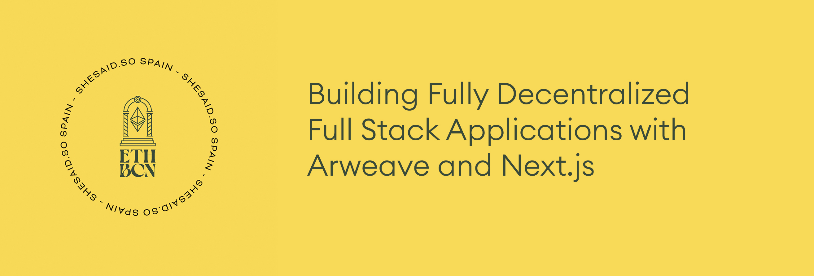

## Full Stack Arweave Workshop

Building Fully Decentralized Applications with [Arweave](https://www.google.com/search?q=arweave&oq=arweave+&aqs=chrome..69i57j69i59j46i131i199i433i465i512j69i60l5.6621j0j4&sourceid=chrome&ie=UTF-8), [Bundlr](https://docs.bundlr.network/), and [Next.js](https://nextjs.org/).



### Prerequisites

1. Node.js installed on your machine

I recommend using either [NVM](https://github.com/nvm-sh/nvm) or [FNM](https://github.com/Schniz/fnm) for Node.js installation

2. Matic, Arbitrum, or Avalanche tokens

If you need tokens, request them in [this](https://t.me/+yVIQiGRRkIU5Yzlh) telegram channel.

3. Metamask installed as a browser extension

4. Fund your Budlr wallet [here](https://demo.bundlr.network/) with around $1.00 of your preferred currency.

## Getting started

To get started, create a new Next.js application

```sh
npx create-next-app arweave-app
```

Next, change into the directory and install the dependencies using either NPM, Yarn, PNPM, or your favoriate package manager:

```sh
cd arweave-app

npm install @bundlr-network/client arweave @emotion/css ethers react-select
```

#### Overview of some of the dependencies

[`@emotion/css`](https://emotion.sh/docs/introduction) - CSS in JavaScript library for styling

[`react-select`](https://react-select.com/) - select input control library for React

[`@bundlr-network/client`](https://github.com/Bundlr-Network/js-client) - JavaScript client for interacting with Bundlr network

[`arweave`](https://github.com/ArweaveTeam/arweave-js) - The Arweave JavaScript library

### Base setup

Now that the dependencies are installed, create a new file named __context.js__ in the root directory. We will use this file to initialize some React context that we'll be using to provide global state between routes.

```javascript
// context.js
import { createContext } from 'react'

export const MainContext = createContext()
```

Next, let's create a new page in the __pages__ directory called ___app.js__.

Here, we want to get started by enabling the user to sign in to bundlr using their MetaMask wallet.

We'll pass this functionality and some state into other pages so that we can use it there.

Add the following code to __pages/app.js__:

```javascript
// pages/_app.js
import '../styles/globals.css'
import { WebBundlr } from "@bundlr-network/client"
import { MainContext } from '../context'
import { useState, useRef } from 'react'
import { providers, utils } from 'ethers'
import { css } from '@emotion/css'
import Link from 'next/link'

function MyApp({ Component, pageProps }) {
  const [bundlrInstance, setBundlrInstance] = useState()
  const [balance, setBalance] = useState(0)
  
  // set the base currency as matic (this can be changed later in the app)
  const [currency, setCurrency] = useState('matic')
  const bundlrRef = useRef()

  // create a function to connect to bundlr network
  async function initialiseBundlr() {
    await window.ethereum.enable()
  
    const provider = new providers.Web3Provider(window.ethereum);
    await provider._ready()
  
    const bundlr = new WebBundlr("https://node1.bundlr.network", currency, provider)
    await bundlr.ready()
    
    setBundlrInstance(bundlr)
    bundlrRef.current = bundlr
    fetchBalance()
  }

  // get the user's bundlr balance
  async function fetchBalance() {
    const bal = await bundlrRef.current.getLoadedBalance()
    console.log('bal: ', utils.formatEther(bal.toString()))
    setBalance(utils.formatEther(bal.toString()))
  }

  return (
    <div>
      <nav className={navStyle}>
        <Link href="/">
          <a>
            <div className={homeLinkStyle}>
              <p className={homeLinkTextStyle}>
                ARWEAVE VIDEO
              </p>
            </div>
          </a>
        </Link>
      </nav>
      <div className={containerStyle}>
        <MainContext.Provider value={{
          initialiseBundlr,
          bundlrInstance,
          balance,
          fetchBalance,
          currency,
          setCurrency
        }}>
          <Component {...pageProps} />
        </MainContext.Provider>
      </div>
      <footer className={footerStyle}>
          <Link href="/profile">
            <a>
              ADMIN
            </a>
          </Link>
      </footer>
    </div>
  )
}

const navHeight = 80
const footerHeight = 70

const navStyle = css`
  height: ${navHeight}px;
  padding: 40px 100px;
  border-bottom: 1px solid #ededed;
  display: flex;
  align-items: center;
`

const homeLinkStyle = css`
  display: flex;
  flex-direction: row;
  align-items: center;
`

const homeLinkTextStyle = css`
  font-weight: 200;
  font-size: 28;
  letter-spacing: 7px;
`

const footerStyle = css`
  border-top: 1px solid #ededed;
  height: ${footerHeight}px;
  padding: 0px 40px;
  display: flex;
  align-items: center;
  justify-content: center;
  font-weight: 200;
  letter-spacing: 1px;
  font-size: 14px;
`

const containerStyle = css`
  min-height: calc(100vh - ${navHeight + footerHeight}px);
  width: 900px;
  margin: 0 auto;
  padding: 40px;
`

export default MyApp
```

What have we done here?

1. Imported the dependencies
2. Created some component state, one to hold the instance of Bundlr, the other to hold the user's wallet balance.
3. Created a function to connect to bundlr - `initialiseBundlr`
4. Created a function to fetch the user's balance - `fetchBalance`
5. Added some basic styling using `emotion`
6. Added some navigation, a footer, and a link in the footer to the `profile` page that has not yet been created.

Next, let's run the app:

```sh
npm run dev
```

You should see the app load and have a header and a footer! 🎉🎉🎉

### Connecting to Bundlr

Next, let's create the UI that will allow the user to choose the currency they'd like to use and connect to Bundlr.

To do so, create a new file in the __pages__ directory named __profile.js__. Here, add the following code:

```javascript
import { useState, useContext } from 'react'
import { MainContext } from '../context'
import { css } from '@emotion/css'
import Select from 'react-select'

// list of supported currencies: https://docs.bundlr.network/docs/currencies
const supportedCurrencies = {
  matic: 'matic',
  ethereum: 'ethereum',
  avalanche: 'avalanche',
  bnb: 'bnb',
  arbitrum: 'arbitrum'
}

const currencyOptions = Object.keys(supportedCurrencies).map(v => {
  return {
    value: v, label: v
  }
})

export default function Profile() {
  // use context to get data and functions passed from _app.js
  const { balance, bundlrInstance, initialiseBundlr, currency, setCurrency } = useContext(MainContext)

  // if the user has not initialized bundlr, allow them to
  if (!bundlrInstance) {
   return  (
     <div>
        <div className={selectContainerStyle} >
          <Select
            onChange={({ value }) => setCurrency(value)}
            options={currencyOptions}
            defaultValue={{ value: currency, label: currency }}
            classNamePrefix="select"
            instanceId="currency"
          />
          <p>Currency: {currency}</p>
        </div>
     <div className={containerStyle}>
       <button className={wideButtonStyle} onClick={initialiseBundlr}>Connect Wallet</button>
     </div>
     </div>
    )
  }

  // once the user has initialized Bundlr, show them their balance
  return (
    <div>
      <h3 className={balanceStyle}>💰 Balance {Math.round(balance * 100) / 100}</h3>
    </div>
  )
}

const selectContainerStyle = css`
  margin: 10px 0px 20px;
`

const containerStyle = css`
  padding: 10px 20px;
  display: flex;
  justify-content: center;
`

const buttonStyle = css`
  background-color: black;
  color: white;
  padding: 12px 40px;
  border-radius: 50px;
  font-weight: 700;
  width: 180;
  transition: all .35s;
  cursor: pointer;
  &:hover {
    background-color: rgba(0, 0, 0, .75);
  }
`

const wideButtonStyle = css`
  ${buttonStyle};
  width: 380px;
`

const balanceStyle = css`
  padding: 10px 25px;
  background-color: rgba(0, 0, 0, .08);
  border-radius: 30px;
  display: inline-block;
  width: 200px;
  text-align: center;
`
```

In this file we've:

1. Defined the array of currencies we'd like to support (full list [here](https://docs.bundlr.network/docs/currencies))
2. Used `useContext` to get the functions and state variables defined in __pages/app.js__ 
3. Created a drop-down menu to enable the user to select the currency they'd like to use
4. Created a button that allows the user to connect to Bundlr network.

Next let's test it out:

```sh
npm run dev
```

You should see a dropdown menu and be able to connect to Bundlr with your wallet! 🎉🎉🎉

### Saving a video

Next, let's add the code that will allow user's to upload and save a video to Arweave with Bundlr.

Create a new file named `utils.js` in the root directory and add the following code:

```javascript
import Arweave from 'arweave'

export const arweave = Arweave.init({})

export const APP_NAME = 'SOME_UNIQUE_APP_NAME'
```

Next, update __pages/profile.js__ with the following code (new code is commented):

```javascript
import { useState, useContext } from 'react'
import { MainContext } from '../context'
import { css } from '@emotion/css'
import Select from 'react-select'

// New imports
import { APP_NAME } from '../utils'
import { useRouter } from 'next/router'
import { utils } from 'ethers'

const supportedCurrencies = {
  matic: 'matic',
  ethereum: 'ethereum',
  avalanche: 'avalanche',
  bnb: 'bnb',
  arbitrum: 'arbitrum'
}

const currencyOptions = Object.keys(supportedCurrencies).map(v => {
  return {
    value: v, label: v
  }
})

export default function Profile() {
  const { balance, bundlrInstance, initialiseBundlr, currency, setCurrency } = useContext(MainContext)

  // New local state variables
  const [file, setFile] = useState()
  const [localVideo, setLocalVideo] = useState()
  const [title, setTitle] = useState('')
  const [description, setDescription] = useState('')
  const [fileCost, setFileCost] = useState()
  const [URI, setURI] = useState()

  // router will allow us to programatically route after file upload
  const router = useRouter()

  // when the file is uploaded, save to local state and calculate cost
  function onFileChange(e) {
    const file = e.target.files[0]
    if (!file) return
    checkUploadCost(file.size)
    if (file) {
      const video = URL.createObjectURL(file)
      setLocalVideo(video)
      let reader = new FileReader()
      reader.onload = function (e) {
        if (reader.result) {
          setFile(Buffer.from(reader.result))
        }
      }
      reader.readAsArrayBuffer(file)
    }
  }

  // save the video to Arweave
  async function uploadFile() {
    if (!file) return
    const tags = [{ name: 'Content-Type', value: 'video/mp4' }]
    try {
      let tx = await bundlrInstance.uploader.upload(file, tags)
      setURI(`http://arweave.net/${tx.data.id}`)
    } catch (err) {
      console.log('Error uploading video: ', err)
    }
  }

    async function checkUploadCost(bytes) {
    if (bytes) {
      const cost = await bundlrInstance.getPrice(bytes)
      setFileCost(utils.formatEther(cost.toString()))
    }
  }

  // save the video and metadata to Arweave
  async function saveVideo() {
    if (!file || !title || !description) return
    const tags = [
      { name: 'Content-Type', value: 'text/plain' },
      { name: 'App-Name', value: APP_NAME }
    ]

    const video = {
      title,
      description,
      URI,
      createdAt: new Date(),
      createdBy: bundlrInstance.address,
    }

    try {
      let tx = await bundlrInstance.createTransaction(JSON.stringify(video), { tags })
      await tx.sign()
      const { data } = await tx.upload()

      console.log(`http://arweave.net/${data.id}`)
      setTimeout(() => {
        router.push('/')
      }, 2000)
    } catch (err) {
      console.log('error uploading video with metadata: ', err)
    }
  }

  if (!bundlrInstance) {
   return  (
     <div>
        <div className={selectContainerStyle} >
          <Select
            onChange={({ value }) => setCurrency(value)}
            options={currencyOptions}
            defaultValue={{ value: currency, label: currency }}
            classNamePrefix="select"
            instanceId="currency"
          />
          <p>Currency: {currency}</p>
        </div>
     <div className={containerStyle}>
       <button className={wideButtonStyle} onClick={initialiseBundlr}>Connect Wallet</button>
     </div>
     </div>
    )
  }


  return (
    <div>
      <h3 className={balanceStyle}>💰 Balance {Math.round(balance * 100) / 100}</h3>
      <div className={formStyle}>
        <p className={labelStyle}>Add Video</p>
        <div className={inputContainerStyle}>
          <input
            type="file"
            onChange={onFileChange}
          />
        </div>
        { /* if there is a video save to local state, display it */}
        {
          localVideo && (
            <video key={localVideo} width="520" controls className={videoStyle}>
              <source src={localVideo} type="video/mp4"/>
            </video>
          )
        }
        {/* display calculated upload cast */}
        {
          fileCost && <h4>Cost to upload: {Math.round((fileCost) * 1000) / 1000} MATIC</h4>
        }
        <button className={buttonStyle} onClick={uploadFile}>Upload Video</button>
        {/* if there is a URI, then show the form to upload it */}
        {
          URI && (
            <div>
               <p className={linkStyle} >
                <a href={URI}>{URI}</a>
               </p>
               <div className={formStyle}>
                 <p className={labelStyle}>Title</p>
                 <input className={inputStyle} onChange={e => setTitle(e.target.value)} placeholder='Video title' />
                 <p className={labelStyle}>Description</p>
                 <textarea placeholder='Video description' onChange={e => setDescription(e.target.value)} className={textAreaStyle}  />
                 <button className={saveVideoButtonStyle} onClick={saveVideo}>Save Video</button>
               </div>
            </div>
          )
        }
      </div>
    </div>
  )
}

const selectContainerStyle = css`
  margin: 10px 0px 20px;
`

const containerStyle = css`
  padding: 10px 20px;
  display: flex;
  justify-content: center;
`

const buttonStyle = css`
  background-color: black;
  color: white;
  padding: 12px 40px;
  border-radius: 50px;
  font-weight: 700;
  width: 180;
  transition: all .35s;
  cursor: pointer;
  &:hover {
    background-color: rgba(0, 0, 0, .75);
  }
`

const wideButtonStyle = css`
  ${buttonStyle};
  width: 380px;
`

const balanceStyle = css`
  padding: 10px 25px;
  background-color: rgba(0, 0, 0, .08);
  border-radius: 30px;
  display: inline-block;
  width: 200px;
  text-align: center;
`

// New Styles
const linkStyle = css`
  margin: 15px 0px;
`

const inputContainerStyle = css`
  margin: 0px 0px 15px;
`

const videoStyle = css`
  margin-bottom: 20px;
`

const formStyle = css`
  display: flex;
  flex-direction: column;
  align-items: flex-start;
  padding: 20px 0px 0px;
`

const labelStyle = css`
  margin: 0px 0px 5px;
`

const inputStyle = css`
  padding: 12px 20px;
  border-radius: 5px;
  border: none;
  outline: none;
  background-color: rgba(0, 0, 0, .08);
  margin-bottom: 15px;
`

const textAreaStyle = css`
  ${inputStyle};
  width: 350px;
  height: 90px;
`

const saveVideoButtonStyle = css`
  ${buttonStyle};
  margin-top: 15px;
`
```

In this file we've done quite a bit!

1. Created local state variable for user input, like the video as well as video title and description
2. Created a function that allows a user to upload a video and save it to the local state
3. Created a function that allows the user to check the price of an upload using the `getPrice` API from Bundlr
4. Created functions that allow the user to upload their video and metadata to Arweave
5. Added form inputs, UI, and styling for enabling the above functionality

Next, let's try it out!

```sh
npm run dev
```

You should now be able to successfully upload a video to the permaweb! 🚀🚀🚀

### Querying for videos

Now that we've uploaded a video, how can we view it?

We'll be using GraphQL to query for the video data from Arweave. Since we passed in a tag for `APP_NAME`, we can use that tag to retrieve only the videos for our app.

Let's define the GraphQL query that we'll be using in __utils.js__:

```javascript
export const query = { query: `{
  transactions(
    first: 50,
    tags: [
      {
        name: "App-Name",
        values: ["${APP_NAME}"]
      },
      {
        name: "Content-Type",
        values: ["text/plain"]
      }
    ]
  ) {
      edges {
        node {
          id
          owner {
            address
          }
          data {
            size
          }
          block {
            height
            timestamp
          }
          tags {
            name,
            value
          }
        }
      }
    }
  }`
}
```

We'll also need a function to fetch the video metadata itself from Arweave for each item returned from the GraphQL query. Add the following function to `utils.js`:

```javascript
export const createVideoMeta = async (node) => {
  const ownerAddress = node.owner.address;
  const height = node.block ? node.block.height : -1;
  const timestamp = node.block ? parseInt(node.block.timestamp, 10) * 1000 : -1;
  const postInfo = {
    txid: node.id,
    owner: ownerAddress,
    height: height,
    length: node.data.size,
    timestamp: timestamp,
  }
  
  postInfo.request = await arweave.api.get(`/${node.id}`, { timeout: 10000 })
  return postInfo;
}
```

Next, update __pages/index.js__ with the following code:

```javascript
import { query, arweave, createVideoMeta } from '../utils'
import { useEffect, useState } from 'react'
import { css } from '@emotion/css'

// basic exponential backoff in case of gateway timeout / error
const wait = (ms) => new Promise((res) => setTimeout(res, ms))

export default function Home() {
  const [videos, setVideos] = useState([])

  // when app loads, fetch videos
  useEffect(() => {
    getVidoes()
  }, [])

  // fetch data from Arweave
  // map over data and fetch metadata for each video then save to local state
  async function getVidoes(topicFilter = null, depth = 0) {
    try {
      const results = await arweave.api.post('/graphql', query)
        .catch(err => {
          console.error('GraphQL query failed')
          throw new Error(err);
        });
      const edges = results.data.data.transactions.edges
      const videos = await Promise.all(
        edges.map(async edge => await createVideoMeta(edge.node))
      )
      let sorted = videos.sort((a, b) => new Date(b.request.data.createdAt) - new Date(a.request.data.createdAt))
      sorted = sorted.map(s => s.request.data)
      setVideos(sorted)
    } catch (err) {
      await wait(2 ** depth * 10)
      getPostInfo(topicFilter, depth + 1)
      console.log('error: ', err)
    }
  }

  return (
    <div className={containerStyle}>
      {/* map over videos and display them in the UI */}
      {
        videos.map(video => (
          <div className={videoContainerStyle} key={video.URI}>
            <video key={video.URI} width="720px" height="405" controls className={videoStyle}>
              <source src={video.URI} type="video/mp4"/>
            </video>
            <div className={titleContainerStyle}>
              <h3 className={titleStyle}>{video.title}</h3>
            </div>
            <p className={descriptionStyle}>{video.description}</p>
          </div>
        ))
      }
    </div>
  )
}

const videoStyle = css`
  background-color: rgba(0, 0, 0, .05);
  box-shadow: rgba(0, 0, 0, 0.15) 0px 5px 15px 0px;
  `

const containerStyle = css`
  width: 720px;
  margin: 0 auto;
  padding: 40px 20px;
  display: flex;
  align-items: center;
  flex-direction: column;
`

const titleContainerStyle = css`
  display: flex;
  justify-content: flex-start;
  margin: 19px 0px 8px;
`

const videoContainerStyle = css`
  display: flex;
  flex-direction: column;
  margin: 20px 0px 40px;
`

const titleStyle = css`
  margin:  0;
  fontSize: 30px;
`

const descriptionStyle = css`
  margin: 0;
`
```

In this file we've:

1. Created a function named `getVidoes` that calls the GraphQL API and returns the video data
2. With the data ID, we can query the Arweave gateway to retrieve the metadata, like the video name, description, and URI.
3. We display the videos and their metadata in the UI

Congratulations, you've just built a full stack decentralized video app! 🚀🚀🚀

### Next steps

Consider deploying your entire app to Arweave. You can do this manually, or use tools like [SpheronHQ](https://spheron.network/) to make it easier with things like DNS support.
